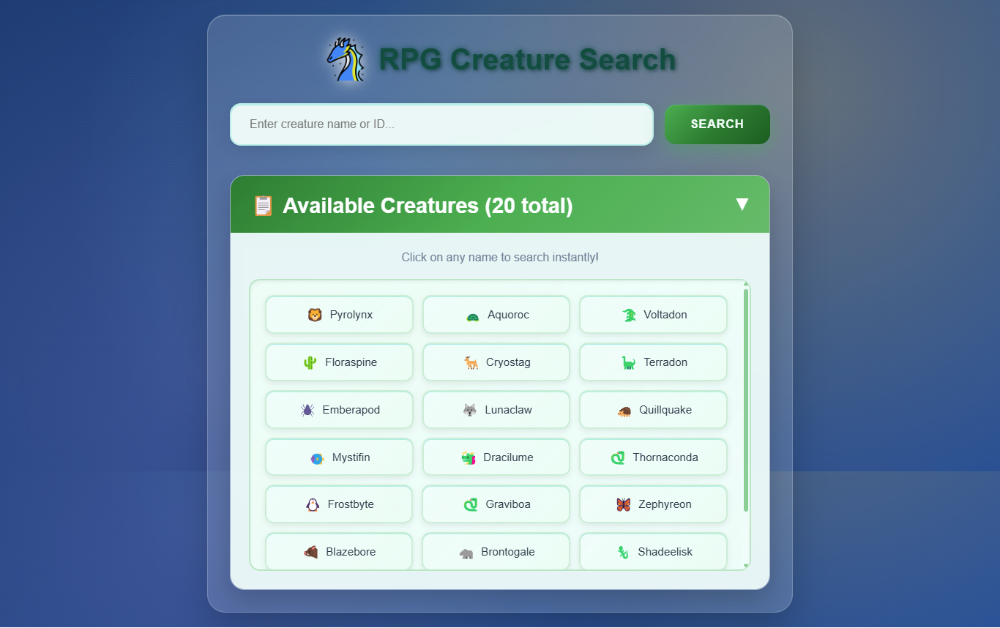

# 🐉 RPG Creature Search App


A fantasy RPG creature search application that fetches data from the freeCodeCamp RPG Creature API. Discover and explore 20 unique fantasy creatures with detailed stats, abilities, types, and artwork in a beautifully designed interface.

## 📸 Screenshots

<div align="center">
  
  <p><em>Fantasy RPG creature search with detailed stats and mystical UI design</em></p>
</div>

## ✨ Live Demo

🌐 **[View RPG Creature Search App](https://rpg-creature-search-app-shibam.vercel.app)**

## 🚀 Key Features

- **🔍 Creature Search**: Search by creature name or ID from 20 available RPG creatures
- **⚔️ Battle Stats**: Complete combat statistics (HP, Attack, Defense, Special Attack, Special Defense, Speed)
- **🎯 Abilities System**: View all creature abilities with detailed descriptions
- **🔥 Type Classification**: Visual type badges for different creature categories
- **🖼️ Fantasy Artwork**: High-quality creature illustrations and sprites
- **📱 Responsive Design**: Optimized experience across all devices
- **📋 Creature Codex**: Expandable list of all available creatures
- **⚡ Real-time API**: Live data from freeCodeCamp's RPG Creature API
- **🌟 Smooth Animations**: Elegant transitions and mystical effects

## 🎨 Design Features

### Visual Elements
- **Dragon Icon**: Authentic fantasy branding with custom dragon logo
- **Mystical Theme**: Dark fantasy color scheme with magical accents
- **Type Badges**: Color-coded creature types matching fantasy themes
- **Card Layout**: Medieval-inspired card design for creature information

### User Experience
- **Instant Search**: Real-time search with Enter key support
- **Error Handling**: Graceful handling of invalid creature searches
- **Loading States**: Mystical loading animations during API calls
- **Close Functionality**: Easy-to-use close button for details view

## 📱 Core Functionality

1. **🔍 Creature Search** - Search by name (e.g., "Pyrolynx") or ID (e.g., "2")
2. **⚔️ Stats Display** - Complete battle statistics with RPG formatting
3. **🎯 Abilities** - All creature abilities displayed with descriptions
4. **🔥 Type System** - Visual type badges (Fire, Water, Earth, Air, etc.)
5. **📋 Creature Codex** - Expandable list of all 20 RPG creatures
6. **🖼️ Artwork Gallery** - High-quality fantasy creature artwork
7. **📱 Responsive Layout** - Optimized for mobile, tablet, and desktop

## 🛠️ Tech Stack

- **⚡ Frontend**: HTML5, CSS3, Vanilla JavaScript
- **🌐 API**: freeCodeCamp RPG Creature API
- **🎨 Styling**: CSS Grid, Flexbox, Fantasy-themed animations
- **📱 Responsive**: Mobile-first responsive design
- **🖼️ Images**: Fantasy creature artwork and sprites
- **🔄 Async**: Modern async/await for API calls

## 🚀 Getting Started

### Prerequisites

- Modern web browser with JavaScript enabled
- Internet connection for API calls
- No additional dependencies required

### Installation

1. **Clone the repository**
   ```bash
   git clone https://github.com/your-username/rpg-creature-search-app.git
   cd rpg-creature-search-app-shibam
   ```

2. **Open the application**
   ```bash
   # Option 1: Open directly in browser
   open index.html
   
   # Option 2: Use a local server (recommended)
   python -m http.server 8000
   # or
   npx serve .
   ```

3. **Start exploring creatures**
   - Enter a creature name or ID in the search box
   - Click "Search" or press Enter
   - Discover detailed creature information and stats

## 📁 Project Structure

```
rpg-creature-search-app-shibam/
├── 📄 index.html              # Main HTML structure
├── 🎨 styles.css              # Styling and responsive design
├── ⚡ script.js               # API integration and app logic
├── 🐉 dragon.png              # Dragon logo asset
├── 📸 screenshot/             # Application screenshots
├── 📖 README.md               # Project documentation
├── 📜 LICENSE                 # MIT License
└── 🚫 .gitignore              # Git ignore rules
```

## 🛠️ Technologies Used

<table>
<tr>
<td align="center"><br><b>HTML5</b></td>
<td align="center"><br><b>CSS3</b></td>
<td align="center"><br><b>JavaScript</b></td>
<td align="center"><br><b>RPG API</b></td>
<td align="center"><br><b>Git</b></td>
</tr>
</table>

## 🎯 API Integration Features

### RPG Creature API Integration
- **Base URL**: `https://pokeapi-proxy.freecodecamp.rocks/api/pokemon`
- **Search Methods**: By creature name (case-insensitive) or ID number
- **Data Retrieved**: Complete creature information including stats, abilities, types
- **Error Handling**: Graceful handling of invalid searches and network errors

### Supported Creature Data
- **Basic Info**: Name, ID, Height, Weight, Base Experience, Order
- **Battle Stats**: HP, Attack, Defense, Special Attack, Special Defense, Speed
- **Abilities**: All available abilities for each creature
- **Types**: Primary and secondary types with visual badges
- **Images**: High-quality fantasy creature artwork

## 🧮 Usage Examples

### Example 1: Search by Name
- **Input**: "Pyrolynx"
- **Result**: Displays Pyrolynx (#2) with all stats and Fire type
- **Features**: Shows abilities and detailed combat statistics

### Example 2: Search by ID
- **Input**: "2"
- **Result**: Displays Pyrolynx with Fire type and balanced stats
- **Features**: Complete creature profile with artwork

### Example 3: Browse All Creatures
- **Action**: Click on accordion to expand Creature Codex
- **Result**: Shows all 20 available RPG creatures in a grid
- **Features**: Click any name to instantly search

### Example 4: Invalid Search
- **Input**: "Red" or invalid creature name
- **Result**: "Creature not found" alert message
- **Features**: User-friendly error handling

## 🎮 RPG Creature Types

The app supports various fantasy creature types:
- **🔥 Fire** - Flame-based creatures with high attack
- **💧 Water** - Aquatic creatures with balanced stats
- **🌿 Grass** - Nature-based creatures with high defense
- **⚡ Electric** - Lightning creatures with high speed
- **🌍 Earth** - Ground-based creatures with high HP
- **🌪️ Air** - Flying creatures with high speed
- **🧊 Ice** - Frost creatures with special abilities
- **🌑 Dark** - Shadow creatures with mysterious powers

## 🌐 Deployment

### 🚀 Quick Deploy Options

1. **GitHub Pages**
   - Push to GitHub repository
   - Enable GitHub Pages in repository settings
   - Access via `https://username.github.io/repository-name`

2. **Netlify**
   - Drag and drop project folder to Netlify
   - Get instant live URL with HTTPS

3. **Vercel**
   - Import GitHub repository
   - Zero-configuration deployment

## 📊 Performance Features

- **Efficient API Calls**: Optimized requests to RPG Creature API
- **Image Optimization**: Lazy loading for creature artwork
- **Caching Strategy**: Browser caching for repeated searches
- **Responsive Images**: Adaptive images for different screen sizes
- **Fast Rendering**: Optimized DOM manipulation

## 🔧 Available Scripts

```bash
# Development
python -m http.server 8000    # Start local development server
npx serve .                   # Alternative local server

# Testing
# Search for different creatures by name and ID
# Test error cases with invalid inputs
```

## 🧪 Testing Examples

Try these searches:
- **By Name**: "Pyrolynx" (Fire type, ID #2)
- **By ID**: "2" (Pyrolynx)
- **Invalid Searches**: "Red", "999", "NotACreature"
- **Case Insensitive**: "PYROLYNX", "pyrolynx", "PyRoLyNx"

## ♿ Accessibility Features

- **Semantic HTML**: Proper heading structure and form elements
- **Keyboard Navigation**: Full keyboard support with Enter key
- **Screen Reader Support**: Alt text for images and ARIA labels
- **High Contrast**: Clear visual distinction between elements
- **Focus Management**: Visible focus indicators

## 🎨 Fantasy Theme Elements

- **Medieval Typography**: Fantasy-inspired fonts and styling
- **Mystical Colors**: Dark theme with magical accent colors
- **Dragon Branding**: Custom dragon icon for authentic RPG feel
- **Card Design**: Medieval scroll-inspired information cards
- **Smooth Animations**: Magical transition effects

## 📝 License

This project is open source and available under the [MIT License](LICENSE).

## 🤝 Contributing

Contributions, issues, and feature requests are welcome! Feel free to check the [issues page](https://github.com/your-username/rpg-creature-search-app/issues).

## 📞 Contact

**Shibam Banerjee**
- Email: Connect-With-Shibam@outlook.com
- Phone: +91 62902-18960
- LinkedIn: [linkedin.com/in/shibam-webdev](https://linkedin.com/in/shibam-webdev)
- GitHub: [github.com/Shibam-Code-Pro](https://github.com/Shibam-Code-Pro)

## 🙏 Acknowledgments

- [freeCodeCamp](https://www.freecodecamp.org/) for providing the RPG Creature API and project inspiration
- [MDN Web Docs](https://developer.mozilla.org/) for comprehensive web development resources
- Fantasy RPG community for inspiration and creature design concepts

---

⭐ **If you found this project helpful, please give it a star!** ⭐
